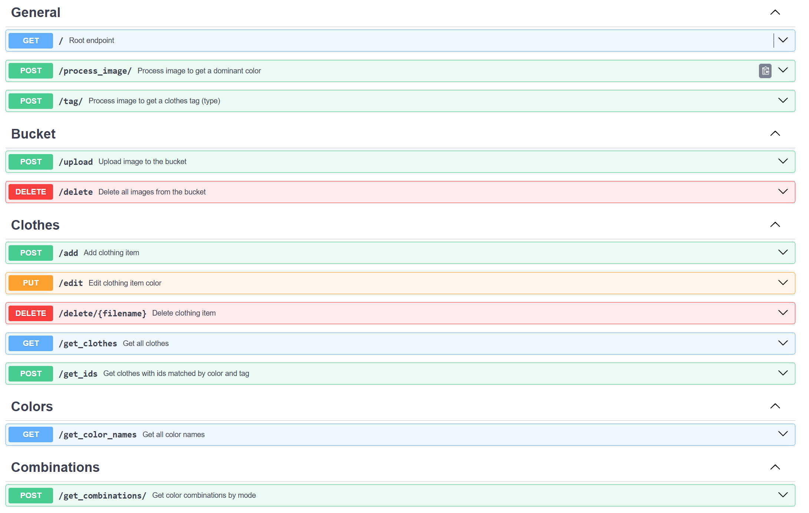

# Clothes Matcher – Backend

Clothes Matcher is an application designed to help color-blind individuals match clothing items based on color.
Visit [this repository](https://github.com/wielkate/ClothesMatching) to learn more.

This is a FastAPI-based backend service for the Clothes Matcher application.
It handles uploaded clothing images, runs AI-based clothing classification, detects dominant colors, and stores everything securely
in [Supabase](https://supabase.com/).
Then lists items matched by color in three modes:

- Monochrome
- Complementary
- Analogous

The application is deployed by [Render](https://render.com/), so it is available online.

## Features

- **AI Classification** – uses Google Gemini to classify clothing items into categories (top, bottom, mid-layer, outerwear).
- **Dominant Color Detection** – analyze uploaded images to determine primary color. 
- **Color-Based Matching** – suggests outfit combinations across three modes: monochrome, complementary, and analogous.
- **Image Upload API** – store images securely in a Supabase bucket.
- **API Versioning** – endpoints are versioned under /v1 for forward compatibility.
- **Frontend Integration** – consumed by the Flet-based client.
- **Database Bootstrap** - creates tables, filling `Colors` and `Combinations`

## Endpoints

Swagger UI is available at `/v1/docs`



## Tech Stack

- **Language:** Python 3.12+
- **Framework:** FastAPI
- **AI Classification:** Google Gemini (`gemini-2.5-flash-lite`)
- **Storage and database:** Supabase (S3-compatible)
- **Deployment:** Render
- **Image Processing:** libraries `colorthief` and `skimage.color`
- **Color Database:** 140 colors supported by modern browsers

## Local usage

1. Clone this repository:
   ```bash
   git clone https://github.com/wielkate/ClothesMatchingApi.git
   cd ClothesMatchingApi

2. Ensure you are on master branch:
   ```bash
   git checkout master

3. Install all the necessary dependencies:
   ```bash
   pip install -r requirements.txt

4. Configure environment variables `SUPABASE_URL` and `SUPABASE_KEY` (and `PASSWORD` if required by your database setup).

5. Run 'service/prepare' to create and fill the database tables: 'Colors', 'Combinations' and 'Clothes'.

6. Start the server:
   ```bash
   uvicorn app:app
   ```
 
7. Note, The v1 routes are mounted under `/v1`, so for example the clothes list endpoint is:

   ```bash
   GET /v1/get_clothes
   ```


## Folder structure

   ```yaml
   ClothesMatchingApi/
   ├── app.py              # FastAPI entry point
   ├── v1.py               # Endpoints for v1
   ├── commons/            # Constants and shared logic
   ├── service/            # Image processing functions
   └── requirements.txt    # Dependencies
   ```

## License

This project is licensed under the MIT License.